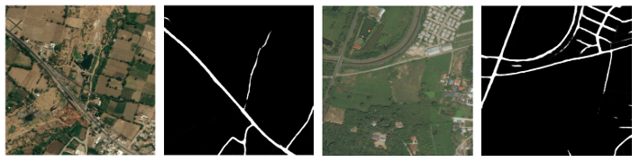

# D-LinkNet For Road Extraction

TensorFlow implementation of D-LinkNet for road extraction.

Details can be found in this paper:

[D-LinkNet: LinkNet with Pretrained Encoder and Dilated Convolution for High
Resolution Satellite Imagery Road Extraction](http://openaccess.thecvf.com/content_cvpr_2018_workshops/papers/w4/Zhou_D-LinkNet_LinkNet_With_CVPR_2018_paper.pdf)

This model uses ResNet 50 provided by TensorFlow-Slim as encoder.
See setting up section for more information.

Dataset is from [DeepGlobe Road Extraction Challenge](https://competitions.codalab.org/competitions/18467#participate-get_starting_kit).

## Requirements
* Python 3.5
* CUDA 9.0
* TensorFlow 1.10

## Setting Up

Before training this model, download `net` folder from 
https://github.com/tensorflow/models/tree/master/research/slim
and place in the root directory of this project. 

This contains necessary files to construct the Res50 model.

## Usage

### Train:

Run `python ./train_slim_model.py`

Options:

`--data_dir=<path>`

    Path to training data.
    Satellite images should have names like *sat*, labeled images should have names like *mask*.
    
`--summary_dir=<path>`

    Save summary to specified path.
    Default to `./summary/`

`--save_dir=<path>` 

    Save model to specified path.
    By default the model will be saved under `<path>/model_<time_string>/`.
    Default to `./model`.
    
`--no_append`

    If set, model will be saved directly under `save_dir`. No sub directory will be made.
    
`--resume_dir=<path>`

    If set, resume training the model from a previous checkpoint.

`--CKPT_RES50=<path>`

    Path to ResNet 50 pre-trained model.
    Default to `./pretrained-checkpoint/resnet_v1_50.ckpt1`.
    
`--num_epoch=<int>`

    Specify number of epochs to train. Default to 16.
 
`--partial_train`

    If set, parameters in Res50 model will not be updated.

### Test:

Run `python ./test_slim_model.py`

Options:

`--input_dir=<path>`

    Path to test files.
    Satellite image files should have name like `_sat.*`.
    Label images (if present) should have name like `_mask.*`.
    If label images are present, iou and loss will be computed.
    
`--output_dir=<path>`

    Path to save results.
    If set, save prediction files to <path>.
    Otherwise results will be saved to input_dir
    
`--ckpt_dir=<path>`

    Path to saved model (checkpoint files).

`--pb_dir=<path>`

    If set, load model from frozen graph. This option overrides `ckpt_dir`.
    
### Generate Frozen Graph:

Run `python ./freezer.py`

Options:

`--ckpt_dir=<path>`
    Path to checkpoint files.
